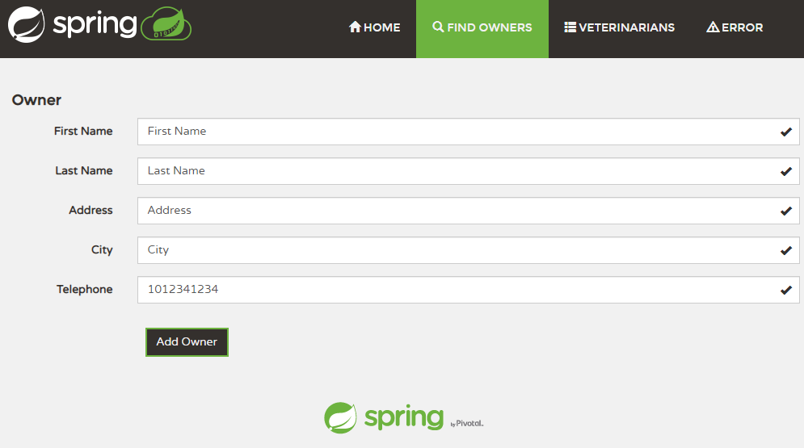

--------------------
# Spring 입문 노트
--------------------

# 목차

- [1. 실행 구조 파악](#실행-구조-파악)
    - [1-1. Log 표시 설정](#Log-표시-설정)
    - [1-2. DEBUG Log 확인](#DEBUG-Log-확인)
- [2. 과제](#과제)
    - [2-1. LastName이 아니라 firstName 으로 검색](1.-LastName이-아니라-firstName-으로-검색)
    - [2-2. 정확한 일치가 아닌 키워드가 포함되도 검색](2.-정확한-일치가-아닌-키워드가-포함되도-검색)
    - [2-3. Owns에 age 추가](3.-Owns에-age-추가)
- [3. Inversion of Control IOC](#Inversion-of-Control)
- [4. Bean IoC 컨테이너가 관리하는 객체](#Bean)
    - [4-1. Spring 컨테이너에 인스턴스를 Bean 등록 방법](#Spring-컨테이너에-인스턴스를-Bean-등록-방법)
- [5. 의존성 주입 (Dependency Injection)](#의존성-주입-(Dependency-Injection))

# 초기 설정

~~~
./mvnw package
java -jar target/*.jar
~~~

# 실행 구조 파악

가장 간단하게 확인하는 방법은 `Log 확인` 입니다.
하지만 기본정의된 Log 표시값은 INFO, WARN .. 등등 기본적인것들 이기때문에
디버깅 Log 를 표시하도록 하여 에플리케이션이 어떻게 동작하는지 알 수 있도록 설정합니다.

## Log 표시 설정

> src/main/resources/application.properties

~~~
...
# Logging
logging.level.org.springframework=INFO
logging.level.org.springframework.web=DEBUG
...
~~~

DEBUG 설정을 주석 제거합니다. 

## DEBUG Log 확인

서버를 재실행 후 http://localhost:8080/owners/new 접속 후 Log 를 확인합니다.

~~~
DEBUG --- o.s.web.servlet.DispatcherServlet        : GET "/owners/new", parameters={}
DEBUG --- s.w.s.m.m.a.RequestMappingHandlerMapping : Mapped to public java.lang.String org.springframework.samples.petclinic.owner.OwnerController.initCreationForm(java.util.Map<java.lang.String, java.lang.Object>)
DEBUG --- o.s.w.s.v.ContentNegotiatingViewResolver : Selected 'text/html' given [text/html, application/xhtml+xml, image/webp, image/apng, application/signed-exchange;v=b3, application/xml;q=0.9, */*;q=0.8]
DEBUG --- o.s.web.servlet.DispatcherServlet        : Completed 200 OK
DEBUG --- o.s.web.servlet.DispatcherServlet        : GET "/resources/images/favicon.png", parameters={}
DEBUG --- o.s.w.s.handler.SimpleUrlHandlerMapping  : Mapped to ResourceHttpRequestHandler ["classpath:/META-INF/resources/", "classpath:/resources/", "classpath:/static/", "classpath:/public/", "/"]
DEBUG --- o.s.web.servlet.DispatcherServlet        : Completed 200 OK
~~~

여기서 확인해야 알것은 s.w.s.m.m.a.RequestMappingHandlerMapping 입니다. 
Mapped to public java.lang.String org.springframework.samples.petclinic.owner.OwnerController.initCreationForm(java.util.Map<java.lang.String, java.lang.Object>)

DispatcherServlet 이 OwnerController Class 의 initCreationForm 메서드를 실행해주고 owners/createOrUpdateOwnerForm 화면에 view 보여지게 됩니다.

~~~
...
private static final String VIEWS_OWNER_CREATE_OR_UPDATE_FORM = "owners/createOrUpdateOwnerForm";

@GetMapping("/owners/new")
public String initCreationForm(Map<String, Object> model) {
    Owner owner = new Owner();
    model.put("owner", owner);
    return VIEWS_OWNER_CREATE_OR_UPDATE_FORM;
}
...
~~~

이번엔 요청 POST 과정을 확인하겠습니다.

~~~
DEBUG --- o.s.web.servlet.DispatcherServlet        : POST "/owners/new", parameters={masked}
DEBUG --- s.w.s.m.m.a.RequestMappingHandlerMapping : Mapped to public java.lang.String org.springframework.samples.petclinic.owner.OwnerController.processCreationForm(org.springframework.samples.petclinic.owner.Owner,org.springframework.validation.BindingResult)
DEBUG --- o.s.web.servlet.view.RedirectView        : View name 'redirect:/owners/11', model {}
DEBUG --- o.s.web.servlet.DispatcherServlet        : Completed 302 FOUND
DEBUG --- o.s.web.servlet.DispatcherServlet        : GET "/owners/11", parameters={}
DEBUG --- s.w.s.m.m.a.RequestMappingHandlerMapping : Mapped to public org.springframework.web.servlet.ModelAndView org.springframework.samples.petclinic.owner.OwnerController.showOwner(int)
DEBUG --- o.s.w.s.v.ContentNegotiatingViewResolver : Selected 'text/html' given [text/html, application/xhtml+xml, image/webp, image/apng, application/signed-exchange;v=b3, application/xml;q=0.9, */*;q=0.8]
DEBUG --- o.s.web.servlet.DispatcherServlet        : Completed 200 OK
~~~

s.w.s.m.m.a.RequestMappingHandlerMapping : Mapped to public java.lang.String org.springframework.samples.petclinic.owner.OwnerController.processCreationForm(org.springframework.samples.petclinic.owner.Owner,org.springframework.validation.BindingResult)

이번엔 OwnerController.processCreationForm 메서드를 실행하는것을 확인했습니다.

~~~
...
@PostMapping("/owners/new")
public String processCreationForm(@Valid Owner owner, BindingResult result) {
    if (result.hasErrors()) {
        return VIEWS_OWNER_CREATE_OR_UPDATE_FORM;
    } else {
        this.owners.save(owner);
        return "redirect:/owners/" + owner.getId();
    }
}
...
~~~

owner 를 생성하여 저장해주고 생성한 owner의 Id 주소 위치로 이동하게 됩니다.
다음 owner의 Id 값을 받는 GET Mapping 으로 이동합니다.

~~~
...
@GetMapping("/owners/{ownerId}")
public ModelAndView showOwner(@PathVariable("ownerId") int ownerId) {
    ModelAndView mav = new ModelAndView("owners/ownerDetails");
    mav.addObject(this.owners.findById(ownerId));
    return mav;
}
...
~~~

좀더 자세하게 알고싶다면 Debug 를 통해서 확인하면 됩니다.

# 과제 

- 1. LastName이 아니라 firstName 으로 검색
- 2. 정확한 일치가 아닌 키워드가 포함되도 검색
- 3. Owns에 age 추가

## 1. LastName이 아니라 firstName 으로 검색

우선 데이터 정보를 하나 생성합니다.

이제 Last Name 이 아닌 Last name 이 검색 될 수 있도록 하겠습니다.  
우선 아무 값이나 전송 후 Log 를 확인하여 어떠한 메서드를 통해서 동작하는지 위치를 파악합니다. 

- 검색 결과 로그
~~~
DEBUG --- o.s.web.servlet.DispatcherServlet        : GET "/owners?lastName=First+Name", parameters={masked}
DEBUG --- s.w.s.m.m.a.RequestMappingHandlerMapping : Mapped to public java.lang.String org.springframework.samples.petclinic.owner.OwnerController.processFindForm(org.springframework.samples.petclinic.owner.Owner,org.springframework.validation.BindingResult,java.util.Map<java.lang.String, java.lang.Object>)
DEBUG --- o.s.w.s.v.ContentNegotiatingViewResolver : Selected 'text/html' given [text/html, application/xhtml+xml, image/webp, image/apng, application/signed-exchange;v=b3, application/xml;q=0.9, */*;q=0.8]
DEBUG --- o.s.web.servlet.DispatcherServlet        : Completed 200 OK
~~~

로그 확인 결과 Get 방식으로 OwnerController 클래스의 processFindForm 메서드를 통해서 실행되는 것을 확인했습니다.

> OwnerController

~~~
@GetMapping("/owners")
public String processFindForm(Owner owner, BindingResult result, Map<String, Object> model) {

    // allow parameterless GET request for /owners to return all records
    if (owner.getLastName() == null) {
        owner.setLastName(""); // empty string signifies broadest possible search
    }

    // find owners by last name
    Collection<Owner> results = this.owners.findByLastName(owner.getLastName());
    if (results.isEmpty()) {
        // no owners found
        result.rejectValue("lastName", "notFound", "not found");
        return "owners/findOwners";
    } else if (results.size() == 1) {
        // 1 owner found
        owner = results.iterator().next();
        return "redirect:/owners/" + owner.getId();
    } else {
        // multiple owners found
        model.put("selections", results);
        return "owners/ownersList";
    }
}
~~~

processFindForm 메소드에서 사용자가 저장한 데이터를 담은 `Owner owner` Entity 를 전달받습니다.
  
우선 `Owner owner` Entity 에 무슨 값이 담아져서 오는지 확인부터 해보겠습니다.

~~~
private static final Logger log = LoggerFactory.getLogger(OwnerController.class);
log.info("등장 - {}", owner);
~~~

slf4j 의 Logger 를 활용하여 검색창에 'First Name' 문자열을 검색 후 owner 값을 출력해 봅시다.

~~~
등장 - [Owner@11fa65d id = [null], new = true, lastName = 'First Name', firstName = [null], address = [null], city = [null], telephone = [null]]

> 정리하면
id = null
new = true
lastName = 'First Name'
firstName = null
address = null
city = null
telephone = null
~~~

lastName, new 값 이외에는 전부 null 값으로 나오는 것을 확인했습니다.
`Owner owner` Entity 의 lastName 을 가져와서 쿼리를 검색 후 찾는 결과물이 나올경우 사용자에게 보여주는 방법인거 같습니다.

~~~
Collection<Owner> results = this.owners.findByLastName(owner.getLastName());
~~~ 

this.owners 는 owner 의 Repository 저장소 이며  JPA 문법 findByLastName 활용하여 LastName 을 포함하는 
쿼리 리스트를 Collection 으로 가져옵니다.

결과값이 비어있는지 혹은 다른 조건이 있는지 체크 후 결과값을 담은 model 을 반환 합니다.
이번 과제의 목표는 firstName 으로 검색될 수 있게 하는것입니다.

FirstName 을 검색할 수 있도록 바꿔야하는 클래스 위치

GET 전송으로 보내는 input value 값  
> findOwners.html

~~~
+ <input class="form-control" th:field="*{firstName}" size="30" maxlength="80" /> 

    

        
Error

    

~~~

서버에 FirstName 값을 확인하고 결과를 반환하는 쿼리 저장소
> OwnerRepository.java

~~~
// FirstName 검색
@Query("SELECT DISTINCT owner FROM Owner owner left join fetch owner.pets WHERE owner.firstName LIKE :firstName%")
@Transactional(readOnly = true)
Collection<Owner> findByFirstName(@Param("firstName") String FirstName);
~~~

Last Name 을 설정하는 것이 아닌 GET FORM 으로 받은 First Name 값을 owner 값에 설정하도록 바꿔줬습니다.
> OwnerController.java

~~~
@GetMapping("/owners")
 public String processFindForm(Owner owner, BindingResult result, Map<String, Object> model) {

     + log.info("등장 - {}", owner);
     
     // allow parameterless GET request for /owners to return all records
     + if (owner.getFirstName() == null) {
     +     owner.setFirstName(""); // empty string signifies broadest possible search
     }

     // find owners by last name
     + Collection<Owner> results = this.owners.findByFirstName(owner.getFirstName());
     if (results.isEmpty()) {
         // no owners found
     +   result.rejectValue("FirstName", "notFound", "not found");
         return "owners/findOwners";
     } else if (results.size() == 1) {
         // 1 owner found
         owner = results.iterator().next();
         return "redirect:/owners/" + owner.getId();
     } else {
         // multiple owners found
         model.put("selections", results);
         return "owners/ownersList";
     }
 }
~~~

~~~
등장 - [Owner@1a535948 id = [null], new = true, lastName = [null], firstName = 'First Name', address = [null], city = [null], telephone = [null]]
~~~

정상적으로 firstName 값을 가져오며 검색되는 것을 확인할 수 있었습니다.

## 2. 정확한 일치가 아닌 키워드가 포함되도 검색

First Name 값 중 Name 만 쳐도 해당 이름을 가진 모든 값을 찾도록 하겠습니다.  
간단하게 쿼리문만 추가 작성하면 됩니다.

> OwnerRepository.java

Like :firstName%

여러개의 검색 조건이 필요한 경우 Like 문법과 % 기호를 양쪽에 넣어주면 됩니다.

[Mysql like 사용법](https://webisfree.com/2014-01-28/[mysql]-%ED%95%84%EB%93%9C%EC%97%90%EC%84%9C-%ED%8A%B9%EC%A0%95%EB%AC%B8%EC%9E%90-%ED%8F%AC%ED%95%A8-%EB%98%90%EB%8A%94-%EC%A0%9C%EC%99%B8%ED%95%9C-db-%EA%B2%80%EC%83%89-like-not)

## 3. Owns에 age 추가

> Owner.java

Integer age 값과 getter, setter 를 추가해주고 사용자에게 age 값을 입력 받을 수 있도록

~~~
private Integer age;

public Integer getAge() {
    return age;
}

public void setAge(Integer age) {
    this.age = age;
}
~~~

> createOrUpdateOwnerForm.html

input 값 age 를 추가 해줍니다.

~~~
<input th:replace="~{fragments/inputField :: input ('Age', 'age', 'text')}" />
~~~ 

> src/main/java/resources/db/hsqldb/schema.sql

schema 값에 age 값을 db에 추가합니다.

~~~
...
CREATE TABLE owners (
  id         INTEGER IDENTITY PRIMARY KEY,
  first_name VARCHAR(30),
  last_name  VARCHAR_IGNORECASE(30),
  address    VARCHAR(255),
  city       VARCHAR(80),
  telephone  VARCHAR(20),
+ age        VARCHAR(150)
);
...
~~~

하지만 아직 실행을 하면 에러가 발생합니다. 그 이유는

> src/main/java/resources/db/hsqldb/data.sql

데이터 값을 추가할때 제가 age 추가한 컬럼을 포함하지 않은 상태로 초기 data가 추가되기 때문에
컴퓨터는 추가된 age 컬럼을 인식하지 못하여 발생한 오류입니다.
추가되는 data 값에 age를 추가해 줍니다.  

Owner List, details 에서 age 값을 확인 할 수 있도록 수정합니다.

> ownersList.html

~~~
<td th:text="${owner.age}"/>
~~~  

> ownersDetails.html

~~~
<tr>
    <th>Age</th>
    <td th:text="*{age}" /></td>
</tr>
~~~

# Inversion of Control

일반적인 (의존성에 대한) 제어권 : 내가 사용할 의존성은 내가 만든다.

~~~
class Controller {
    private Rrepository repository = new Repository(); 
}
~~~

의존성의 제어권이 Inversion(역전) 된다고 생각하면 의존성의 제어권을 자기 자신이 가지고 있었는데

- Ioc "내가 사용할 의존성을 누군가 알아서 주겠지"
    - 내가 사용할 의존성의 타입(또는 인터페이스)만 맞으면 어떤거든 상관없다.
    - 그래야 내 코드 테스트 하기도 편하지.
    
~~~
class Controller {
    private Rrepository repository;

    public Controller(Rrepository repository) {
        this.repository = repository;
    }
}
~~~

Controller 에서 repository 를 사용을 하지만 해당 클래스에서 만들어 사용하지 않습니다.  
다른 곳에서 repository 객체를 생성하여 Controller 에게 생성자를 통해서 받아와 사용합니다.   
이렇게 되면 의존성을 만드는 일은 Controller 에서 하지 않고 누군가 밖에서 의존성 관리를 해줍니다.   
의존성을 주입해 주는것을 `Defence Injection` 이라 부르고 이 자체를 `Inversion of Control` 입니다.

## Inversion of Control IOC 컨테이너 란?

빈(Bean)을 만들고 의존성을 엮어주며 제공해준다.

여러가지 방법으로 등록된 Bean들은 서로간의 의존성 주입을 Spring IOC 컨테이너가 알아서 해줍니다.  
의존성 주입은 빈(Bean) 끼리만 가능합니다.  
즉 Spring IOC 컨테이너 안에 들어있는 객체들 끼리만 의존성 주입을 해줄 수 있습니다.

# Bean

~~~
1. Controller controller = new Controller();

2. Controller bean = applicationContext.getBean(Controller.class);
~~~

- 1. 첫번째 Controller 객체는 Bean 이 아닙니다. 직접 생성한 객체이기 때문입니다. applicationContext 관련 없습니다.
- 2. 두번째 Controller 객체는 applicationContext 가 관리하는 객체에서 가져온것임으로 Bean 이 맞습니다.

Spring 에서의 `Bean 은 applicationContext 가 관리하는 객체`를 의미합니다.

## Spring 컨테이너에 인스턴스를 Bean 등록 방법

- 1. Component Scanning
    - @Component
        - @Repository
        - @Service
        - @Controller
    - 또는 직접 일일히 XML이나 자바 설정 파일에 등록

- 2. 어떻게 꺼내쓰지?
    - @Autowired 또는 @Inject
    - 또는 applicationContext에서 getBean()으로 직접 꺼내 쓴다.

- 특징 
    - 오로지 Bean 들로만 의존성 주입을 해준다.
    
> /Application/SpringBootApplication

@SpringBootApplication 어노테이션 내부에 

~~~
@ComponentScan(
    excludeFilters = {@Filter(
    type = FilterType.CUSTOM,
    classes = {TypeExcludeFilter.class}
), @Filter(
    type = FilterType.CUSTOM,
    classes = {AutoConfigurationExcludeFilter.class}
)}
)
~~~

ComponentScan 이라는 어노테이션이 존재합니다.
ComponentScan 부터 모든 하위 클래스를 컴포넌트를 찾아보라고 해당 어노테이션은 알려줍니다.

# 의존성 주입 (Dependency Injection)

- @Autowired / @Inject를 어디에 사용하나
    - 생성자
    - 필드
    - Setter

Spring 프레임워크 레퍼런스에서 권장하는 방법은 `생성자` 입니다.

~~~
class Controller {
    private final Repository owners;

    public Controller(Repository service) {
        this.owners = service;
    }
}
~~~

필수적으로 사용해야 하는 레퍼런스 생성자(의존성) 없이는 
Controller 인스턴스 클래스를 만들 수 없도록 강제 할 수 있습니다.
Controller 인스턴스 클래스는 Repository owners 클래스가 없다면 작동하지 않는 클래스 입니다.
Repository owners 클래스는 Controller 인스턴스에 반드시 존재해야 하는 객체입니다.

# AOP (Aspect Oriented Programming) 소개

흩어진 코드를 한 곳으로 모아